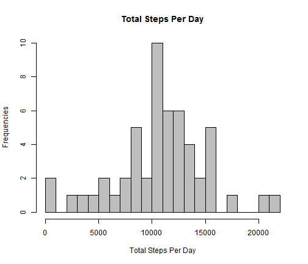
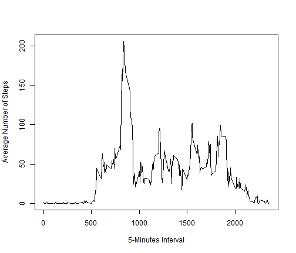
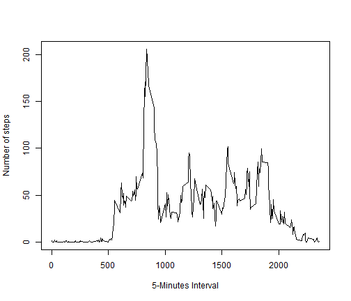
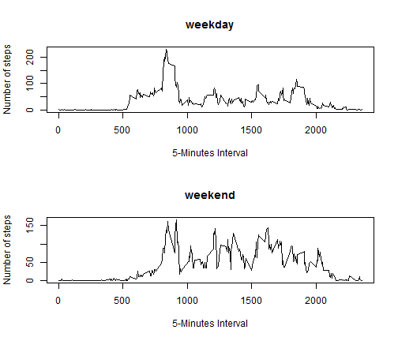

Reproducible Research: Peer Assessment 1
========================================================
Zi Yen Ler

## Loading and Preprocessing Of Data
The original monitor device dataset activity.csv is loaded and includes three columns: steps, date and interval. The steps are the number of steps taken in 5 minute intervals each day between the months of October and November 2012. The number of rows in the dataset is 17568 rows.
The date field is reformatted to date datatype.

```r
data <- read.csv("activity.csv", header = TRUE, sep = ",")
data$date <- as.Date(data$date, format = "%Y-%m-%d")
head(data)
```

```
##   steps       date interval
## 1    NA 2012-10-01        0
## 2    NA 2012-10-01        5
## 3    NA 2012-10-01       10
## 4    NA 2012-10-01       15
## 5    NA 2012-10-01       20
## 6    NA 2012-10-01       25
```

```r
nrow(data)
```

```
## [1] 17568
```

## Mean Total Number of Steps Taken Per Day
As a first step in plotting the histogram, the missing values (coded as NA) are removed from the dataset.
The number of rows after removal of NA values is 15264 rows.

```r
## remove NA from the dataset number of rows with proper data is 15264
cleandata <- data[complete.cases(data), ]
head(cleandata)
```

```
##     steps       date interval
## 289     0 2012-10-02        0
## 290     0 2012-10-02        5
## 291     0 2012-10-02       10
## 292     0 2012-10-02       15
## 293     0 2012-10-02       20
## 294     0 2012-10-02       25
```

```r
nrow(cleandata)
```

```
## [1] 15264
```

The step column in the data is subsequently aggregated by date to produce a dataset of unique date with its corresponding sum of steps for that date. The number of rows in the data set is 53 rows.

```r
## total number of steps taken per day histdata has in each row a unique date
## and its corresponding sum of steps on that date
histdata <- aggregate(steps ~ date, data = cleandata, sum)
head(histdata)
```

```
##         date steps
## 1 2012-10-02   126
## 2 2012-10-03 11352
## 3 2012-10-04 12116
## 4 2012-10-05 13294
## 5 2012-10-06 15420
## 6 2012-10-07 11015
```

```r
nrow(histdata)
```

```
## [1] 53
```


The histogram depicting the total number of steps taken per day is drawn using the sum of steps for that date:

```r
hist(histdata$steps, col = "gray", border = "black", main = "Total Steps Per Day", 
    ylab = "Frequencies", xlab = "Total Steps Per Day", breaks = 20)
```




The mean total number of steps taken per day is as followed:

```r
## mean total number of steps taken per day
histmean <- mean(as.numeric(as.character(histdata$steps)))
histmean
```

```
## [1] 10766
```


The median total number of steps taken per day is as followed:

```r
## median total number of steps taken per day
histmedian <- median(as.numeric(as.character(histdata$steps)))
histmedian
```

```
## [1] 10765
```

## Average Daily Activity Pattern
To understand the average daily activity pattern, we take an aggregated view of the average number of steps across all the dates at each time interval. The average number of steps is calculated from the original dataset with NA missing values.

```r
## average steps in each 5-minutes interval
intervaldata <- aggregate(steps ~ interval, data = data, mean)
head(intervaldata)
```

```
##   interval   steps
## 1        0 1.71698
## 2        5 0.33962
## 3       10 0.13208
## 4       15 0.15094
## 5       20 0.07547
## 6       25 2.09434
```


A time series plot depicting the 288 average number of steps taken across all dates is drawn as below:

```r
plot(as.numeric(as.character(intervaldata$interval)), as.numeric(as.character(intervaldata$steps)), 
    type = "l", ylab = "Average Number of Steps", xlab = "5-Minutes Interval")
```




The average 5-minute interval across all the days with a maximum number of steps of 206.1698113 in the dataset is as below:

```r
## maximum number of steps is 835 interval with 206.1698113 steps
intervaldata$interval[intervaldata$steps == max(intervaldata$steps)]
```

```
## [1] 835
```


## Imputing missing values
There are a number of days/intervals with missing values (coded as NA). The presence of missing days might introduce bias into the calculation and summary of average daily activity pattern. Therfore, another iteration of analysis upton data without missing NA values is undertaken to determine the average daily activity pattern.

The number of data with missing values (encoded as NA) are as below:

```r
## number of NAs in dataset is 2304
missingdata <- data[!complete.cases(data), ]
nrow(missingdata)
```

```
## [1] 2304
```


A new dataset is derived using the strategy of replacing all missing NA values in the dataset with corresponding mean of the 5-minute interval the value is in.

```r
## replacement of NAs with mean of interval
library(zoo)
newdata <- transform(data, steps = na.aggregate(steps, by = interval))
head(newdata)
```

```
##     steps       date interval
## 1 1.71698 2012-10-01        0
## 2 0.33962 2012-10-01        5
## 3 0.13208 2012-10-01       10
## 4 0.15094 2012-10-01       15
## 5 0.07547 2012-10-01       20
## 6 2.09434 2012-10-01       25
```


The average daily activity pattern using the average number of steps across all the dates at each time interval on the new curated dataset is calculated:

```r
newintervaldata <- aggregate(steps ~ interval, data = newdata, mean)
head(newintervaldata)
```

```
##   interval   steps
## 1        0 1.71698
## 2        5 0.33962
## 3       10 0.13208
## 4       15 0.15094
## 5       20 0.07547
## 6       25 2.09434
```


A new time series plot depicting the 288 average number of steps taken across all dates for the new curated dataset is drawn as below:

```r
plot(as.numeric(as.character(newintervaldata$interval)), as.numeric(as.character(newintervaldata$steps)), 
    type = "l", ylab = "Number of steps", xlab = "5-Minutes Interval")
```




The average 5-minute interval across all the days in the curated dataset with a maximum number of steps of 206.1698113 is as below:

```r
## maximum number of steps is 835 interval with 206.1698113 steps
newintervaldata$interval[newintervaldata$steps == max(newintervaldata$steps)]
```

```
## [1] 835
```


The mean of the average number of steps before and after missing NA values are removed are as followed:

```r
## mean total number of steps taken per day
oldseriesdatamean <- mean(as.numeric(as.character(intervaldata$steps)))
oldseriesdatamean
```

```
## [1] 37.38
```

```r
newseriesdatamean <- mean(as.numeric(as.character(newintervaldata$steps)))
newseriesdatamean
```

```
## [1] 37.38
```

The median of the average number of steps before and after missing NA values are removed are as followed:

```r
## median total number of steps taken per day
oldseriesdatamedian <- median(as.numeric(as.character(intervaldata$steps)))
oldseriesdatamedian
```

```
## [1] 34.11
```

```r
newseriesdatamedian <- median(as.numeric(as.character(newintervaldata$steps)))
newseriesdatamedian
```

```
## [1] 34.11
```

 
We can conclude based on the before and after max, mean and median values that the presence of NA values did not introduce bias into our understanding of the average daily activity pattern. The imputing of missing data has contributed to a curated larger dataset for further analysis possibility.

## Differences in activity patterns between weekdays and weekends
The data is subsequently expanded to distinguish between weekdays and weekends dates. There are 12960 weekdays dates and 4608 weekend dates.

```r
## creating new interval data set with weekend and weekday
newdata$weekday <- weekdays(newdata$date)
newdata$weekday[newdata$weekday %in% c("Saturday", "Sunday")] <- "weekend"
newdata$weekday[newdata$weekday %in% c("Monday", "Tuesday", "Wednesday", "Thursday", 
    "Friday")] <- "weekday"
newdata$weekday <- as.factor(newdata$weekday)
subsetweekend <- subset(newdata, newdata$weekday == "weekend")
subsetweekday <- subset(newdata, newdata$weekday == "weekday")
head(subsetweekday)
```

```
##     steps       date interval weekday
## 1 1.71698 2012-10-01        0 weekday
## 2 0.33962 2012-10-01        5 weekday
## 3 0.13208 2012-10-01       10 weekday
## 4 0.15094 2012-10-01       15 weekday
## 5 0.07547 2012-10-01       20 weekday
## 6 2.09434 2012-10-01       25 weekday
```

```r
nrow(subsetweekday)
```

```
## [1] 12960
```

```r
head(subsetweekend)
```

```
##      steps       date interval weekday
## 1441     0 2012-10-06        0 weekend
## 1442     0 2012-10-06        5 weekend
## 1443     0 2012-10-06       10 weekend
## 1444     0 2012-10-06       15 weekend
## 1445     0 2012-10-06       20 weekend
## 1446     0 2012-10-06       25 weekend
```

```r
nrow(subsetweekend)
```

```
## [1] 4608
```


The average number of steps across all weekdays and weekends dates for the 288 intervals are subsequently calculated:

```r
## creating new subset weekend interval data and weekday interval data
weekdayonlymean <- aggregate(steps ~ interval, data = subsetweekday, mean)
head(weekdayonlymean)
```

```
##   interval   steps
## 1        0 2.25115
## 2        5 0.44528
## 3       10 0.17317
## 4       15 0.19790
## 5       20 0.09895
## 6       25 1.59036
```

```r
weekendonlymean <- aggregate(steps ~ interval, data = subsetweekend, mean)
head(weekendonlymean)
```

```
##   interval    steps
## 1        0 0.214623
## 2        5 0.042453
## 3       10 0.016509
## 4       15 0.018868
## 5       20 0.009434
## 6       25 3.511792
```

 
A panel plot with two time series plots of the 5-minute interval and the average number of steps taken averaged across all weekday dates or weekend dates are shown as below:

```r
par(mfrow = c(2, 1))
plot(as.numeric(as.character(weekdayonlymean$interval)), as.numeric(as.character(weekdayonlymean$steps)), 
    cex = 0.8, type = "l", ylab = "Number of steps", xlab = "5-Minutes Interval", 
    main = "weekday")
plot(as.numeric(as.character(weekendonlymean$interval)), as.numeric(as.character(weekendonlymean$steps)), 
    cex = 0.8, type = "l", ylab = "Number of steps", xlab = "5-Minutes Interval", 
    main = "weekend")
```




The max, mean and median of the average number of steps across all weekdays dates for the 288 intervals are calculated as below:

```r
weekdayonlymean$interval[weekdayonlymean$steps == max(weekdayonlymean$steps)]
```

```
## [1] 835
```

```r
wkdaymean <- mean(as.numeric(as.character(weekdayonlymean$steps)))
wkdaymean
```

```
## [1] 35.61
```

```r
wkdaymedian <- median(as.numeric(as.character(weekdayonlymean$steps)))
wkdaymedian
```

```
## [1] 25.8
```

The max, mean and median of the average number of steps across all weekends dates for the 288 intervals are calculated as below:

```r
weekendonlymean$interval[weekendonlymean$steps == max(weekendonlymean$steps)]
```

```
## [1] 915
```

```r
wkendmean <- mean(as.numeric(as.character(weekendonlymean$steps)))
wkendmean
```

```
## [1] 42.37
```

```r
wkendmedian <- median(as.numeric(as.character(weekendonlymean$steps)))
wkendmedian
```

```
## [1] 32.34
```


The time series and the max, mean and median calculation indicate that the average activity pattern measured through average number of steps peaked during the weekend (in comparison to weekdays) with a recorded max interval of 915 with 166.6 steps, mean average number of steps of 42.37 and median average number of steps of 32.34.
